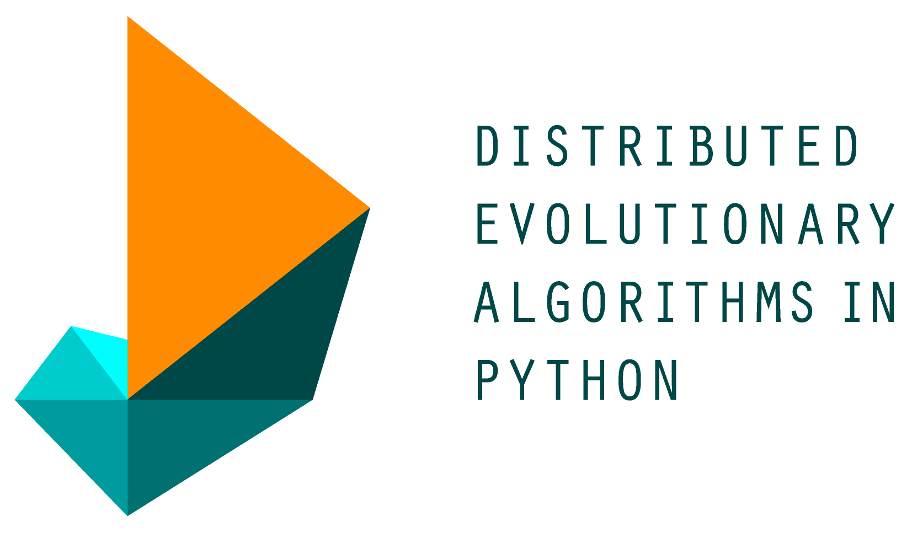
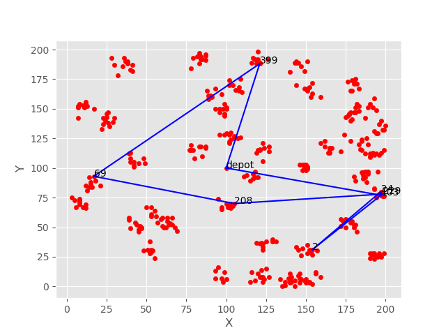
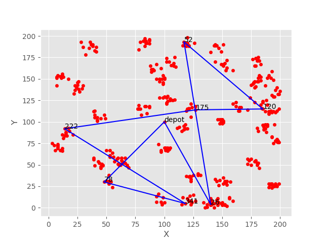
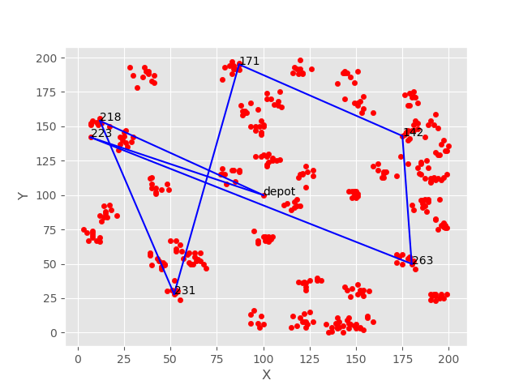

# Using Genetic Algorithm to Solve Large Scale Vehicle Routing Problem with Time Windows

**CONTENTS:**

1. **About the problem**
  1. **Problem Description**
  2. **Problem Complexity**
  3. **How to solve it?**
2. **The Biology Behind Genetic Algorithm**
  1. **Thought Experiment**
  2. **Features of GA**
3. **Genetic Algorithm**
4. **Using DEAP to model Genetic Algorithms**
5. **Modelling VRPTW**
6. **Code**
7. **Questions**

# About The Problem:

## Problem Description

A potential client once approached my organization with a problem their organization was facing. Their organization&#39;s business model was producing and distributing a particular type of resource to different businesses across a particular geography. The client had around 50 trucks and 300 customers around the country which they cater their resource every single day. Most of their clients require the resources to be delivered in a particular time window. This time window was fixed more often than not.

Their problem was they were not able to cater 'their' customers in time. Sometimes the waiting time for the vehicles was too high and sometimes they would be late thus missing the time window, either they would have to pay the delay penalty or they would not be allowed to deliver at all forcing them to either skip that customer or wait until the next time window. Thus having resources and enough vehicles to distribute them, the client was not able to make important operational decision. The VRPTWs are one of the hardest problems to solve, specially when the number of customers go beyond 50 or so. This time  it was 300.
(Another important mention is that the organization strictly followed the driving time constraints of the drivers, this was somewhat similar to the US Department of Transport Rules imposed on long haul and short haul truck drivers.  This made it even more difficult for the problem to be solved using classical optimization techniques. We had to research to find a more plausible, smart and efficient and low cost solution to deploy to serve our clients).

See the image below to get a clearer picture of the problem in hand:


Here, 
O<sub>i</sub> is the i<sup>th</sup> customer that needs to be catered, and e<sub>i</sub> and l<sub>i</sub> are the earliest and latest time of the time windows imposed by the customers.


## Problem Complexity:

  The VRPTW or Vehicle Routing Problem with Time windows is one of the most extensively studied and one which has the most applications in real life scenario, that does not make it any less easier to solve the problem itself, it just means that the problem is a pain in the place where it should not be.

Vehicle Routing Problems belong to a class of problems collectively known as Traveling Salesman Problem which itself is an NP-Hard problem for even an instance of 20 nodes, the time complexity of these problems  are O(n!). This makes it extremely difficult to solve, we will not include the resource constraint brought by time windows and modeling for multiple vehicles with sometimes variable demands.


Thankfully there is a lot of research that has been carried along in this area and many people have made valuable contribution for this problem. One of whom is Solomon who has generated the test instance for the problem and these test instances are used for bench-marking the problems. 
The benchmark data are of three types: Randomly selected data points as customer locations, clustered data points as the customer locations and a mix of randomly selected and clustered data points for the customer locations.

Solomon's instances are only applicable for problems with 100 customers, and when it comes to problems with more than 100 customers (which is our case, 300) there are other benchmark instances provided by Gehrig and Homberger. I have included the Gehrig and Homberger instances 400 customers in the VRPTW data. The VRPTW code is inspired by iRB-Lab's and pauliwalli's VRPTW-GA  and I believe I should give the credit where it is due.

## How to solve it?

The next question that arises is how we should solve the problem. The client was not ready to invest in any major solver so that we could make a mathematical model to give them a better solution. That marked out our choices of Mathematical Modelling and Constraint Programming. The sintef website shows the best solution for VRPTW problems and the techniques that were applied to solve them.

The solution should have the following features:

1. It should not use MIP solvers as we cannot afford one.
2. It should not be a black box, meaning we should know how far our solution from the optima is.
3. The solution should not take more time than we have.

The link for sintef website where you can find the data and different solutions and bibliography related to this problem has been attached below:
[Click here to see the VRPTW's sintef page](https://sintef.no/projectweb/top/vrptw/)<br>
That is when we decided to solve the VRPTW problem using Genetic Algorithm. See Sintef's website for the reference, there are multiple Evolutionary Algorithms deployed to solve VRPTW's for Gehrig and Homberger's benchmark instances

Of-course, GA is not the  only way we could solve it, but given the resources and the promising solution, we chose it. Here are other ways one could solve the problem, and most of them are extensively used and widely studied in research and practice.


## The Biology behind Genetic Algorithm:

1. 1.Thought Experiment:

(see slides)

1. 2.Features of GA

I will delve a little into Biology in this one, we will talk about things that most of you are aware of, or at the least have heard the terms. Viz. DNA, How Lifeforms evolved, and how the chromosomal crossover or reproduction takes place in most multi-cellular organisms.

The DNA are a bunch of ice and organic molecules bounded together a part of which consists of genetic code that models life, reproduction, evolution, and mutation. We will talk about all these terms in the later slides, as well discuss them into more details with the algorithm.

One of the most important aspect of DNA is its ability to replicate, most of the times, chromosomal crossover is the way this takes place. The picture below gives an account of how two different strands of DNA&#39;s combine or recombine together to form a new unique DNA which inherits from their traits.


This important feature along with others, give characteristics to complex organic molecules worthy of calling it life. The features of GA are as follows:

1. Encoding
2. Fitness Function
3. Selection
4. Crossover
5. Mutation

I. Encoding:
Encoding refers to the structure of the DNA in consideration, the encoding of DNA's makes different species so unique and specific. Of course when it all began the encoding was such that only single cellular organisms could  be replicated, but as time passed, there were multi-cellular organisms, the cambrian explosion, the release of oxygen in air, the evolution of ocean bourne animals to terretrial animal, then mammals, dinosaurs, apes, and human beings and then dogs.

II. Fitness Function:
Fitness function refers to the quantitative assesment imposed by nature or by other living organisms(mostly humans) that affect the evolutionary process of an individual species. The fitness function makes no sense until and unless we talk more about the selection process.

III. Selection:
Selectionn refers to selectin the individuals so that their traits will be passed on to the next generation, biologically speaking, those genes which pass on to the next generation, survive, while those do do not, do not. But the catch is nature selects the genes based upon their fitness function and  this fitness function makes it easier to filter out individuals which can to lead to an extinction of species.

IV. Crossover:
The next important thing in an evolutionary cycle is the process called crossover, also called as reproduction. As the name suggests, it is the process where two homologous -- of same relation, DNA's recomine into one DNA thus producing what biologists called offspring, or what  humans call children. Naturally, a child will inherit the traits of her parents, and this happens in a probabilistic fashion. Meaning, it will not be certain what percentage of male and female DNA's were recombined to produce the offspring.

V. Mutation:
Mutation refers to random change in a single gene of a chromosome to make sure the species survive under extreme or unforseen condition. More mathematically speaking, a mutation makes sure that the solution is not lost in local optima.

The image below shows the process of mutation due to UV rays, well the principle is the same as natural mutation.


## Genetic Algorithm:
The following image shows a simple genetic algorithms that is used in one of the code to understand GA better.


The following images show how Evolution works given thousands or millions of years. Dogs as a species never existed before 30,000 years or so and whales were once land borne creatures, they later returned to water(ocean). Quoting Carl Sagan, "These are some of the things that molecules do given 4 billion years of evolution!"


## Using DEAP framework:
Now as far as implementation is concerned, there is nothing as good and well written as the python package DEAP. DEAP stands for distributedd Evolutionary Algorithms in Python. The framework can be used to model sophisticated Genetic Algorithms in a shorter time. DEAP has many inbuilt functionalities which makes modelling algorithms easy and thus save time and hassle with programming languages like C++ or Java.



```python
#!/usr/bin/env python

"""Simple_GA.py: A simple example of string mathcing Genetic Algorithm from
                 scratch for demo."""

__author__      = "Atul Malhari Chavan"


import string
from fuzzywuzzy import fuzz
import random

in_str = 'hyperplane'


# fuzz.ratio('this', 'this!')

class Individual:
    def __init__(self, length):
        self.string = ''.join(random.choice(string.ascii_lowercase)
                              for _ in range(length))
        self.fitness = -1
    def __str__(self):
        return 'String: {}, Fitness: {}'.format(self.string, str(self.fitness))


def init_individuals(population, length):
    return [Individual(length) for _ in range(population)]


def fitness(individuals):
    for individual in individuals:
        individual.fitness = fuzz.ratio(individual.string, in_str)
    return individuals


def selection(individuals, probSelection):
    individuals = sorted(individuals,
                         key=lambda individual: individual.fitness,
                         reverse=True)
    print('\n'.join(map(str, individuals)))
    individuals = individuals[:int(probSelection*(len(individuals)))]
    return individuals


def crossover(individuals, probCrossover, population, length):
    offsprings = []
    for _ in range(population - int((len(individuals))*probCrossover)):
        parent1, parent2 = tuple(random.sample(individuals, 2))
        offspring1, offspring2 = Individual(length), Individual(length)
        crosspoint = random.randint(0, length)
        offspring1.string = (parent1.string[0:crosspoint] +
                             parent2.string[crosspoint:length])
        offspring2.string = (parent2.string[0:crosspoint] +
                             parent1.string[crosspoint:length])
        offsprings.append(offspring1)
        offsprings.append(offspring2)
    individuals.extend(offsprings)
    return individuals


def mutation(individuals, probMutation):
    for individual in individuals:
        for idx, param in enumerate(individual.string):
            if random.uniform(0.0, 1.0) <= probMutation:
                individual.string = (individual.string[0:idx] +
                                     random.choice(string.ascii_letters) +
                                     individual.string[idx+1:])
    return individuals


def ga(population, length, generations, probSelection, probMutation, probCrossover):

    individuals = init_individuals(population, length)
    for generation in range(generations):
        print("Generation: " + str(generation))
        individuals = fitness(individuals)
        individuals = selection(individuals, probSelection)
        individuals = crossover(individuals, probCrossover, population, length)
        individuals = mutation(individuals, probMutation)


        if any(individual.fitness >=95 for individual in individuals):
            print("Threshold met")
            exit(0)


ga(300, len(in_str), 300, 0.40, 0.10, 0.5)

# population = 30
# length= len(in_str)
# generations=200
# probSelection=0.40
# probMutation=0.10
# probCrossover=0.5
#
# print([i.string for i in individuals])
# print([i.fitness for i in individuals])
```

The same code written above has been replicated in DEAP. You see how easy it  is to model in DEAP the same code we modelled from scratch. Lesser lines, easy to implement functions, predefined functions, and a more verbose code.

```python
import random
import string
from deap import base
from deap import creator, algorithms
from deap import tools
from functools import partial
import numpy
from fuzzywuzzy import fuzz


in_str = 'hyperplane'


def evalString(individual):
    ratio = fuzz.ratio(in_str, ''.join(individual))
    return ratio,

creator.create("Fitnessmax", base.Fitness, weights=(1.0,))
creator.create("Individual", list, fitness=creator.Fitnessmax)
creator.Individual()
toolbox = base.Toolbox()
toolbox.register('random_string', (lambda x:
                                   ''.join(random.choice(string.ascii_letters)
                                   for i in range(x))), len(in_str))

toolbox.random_string()

toolbox.register("individual", tools.initIterate, creator.Individual,
                 toolbox.random_string)


toolbox.register("population", tools.initRepeat, list, toolbox.individual)

toolbox.register('evaluate', evalString)
toolbox.register("mate", tools.cxOnePoint)
toolbox.register("mutate", tools.mutShuffleIndexes, indpb=2.0/len(in_str))
toolbox.register("select", tools.selTournament, tournsize=2)


def main(seed=0):
    random.seed(seed)
    pop = toolbox.population(n=300)
    hof = tools.HallOfFame(5)
    stats = tools.Statistics(lambda ind: ind.fitness.values)
    stats.register("Avg", numpy.mean)
    stats.register("Std", numpy.std)
    stats.register("Min", numpy.min)
    stats.register("Max", numpy.max)

    algorithms.eaSimple(pop, toolbox, cxpb=0.5, mutpb=0.2, ngen=100, stats=stats,
                        halloffame=hof, verbose=True)
    print(hof.items)

    return pop, stats, hof


if __name__ == "__main__":
    main()
```


## Modeling VRPTW in DEAP

And now back to the problem. We have in hand a prolem that is impossible to solve given the classical methods of Optimization. We had decided to employ a more modern Evolutionary Algorithm to  solve the problem. We have gone through all the principles of GA and the how's and what's of its implementation.

Thankfully it is easier than other optimization problems since here, we can use a list as a route and evaluate each route based on the objective functions, constraints and evolve the solution by using all the paramters we can control.
Here is an example of a route for 100 customer problem.

```python
[22, 5, 45, 40, 53, 66, 56, 61, 29, 2, 100, 25, 32, 34, 62, 37, 77, 35, 97, 43, 80, 46, 57, 98, 50, 55, 3, 9, 12, 33, 65, 81, 39, 86, 73, 96, 76, 67, 78, 71, 59, 87, 31, 51, 4, 28, 79, 1, 60, 54, 64, 44, 92, 42, 85, 74, 7, 63, 26, 41, 19, 69, 99, 70, 75, 93, 52, 90, 14, 72, 38, 10, 58, 17, 68, 18, 47, 13, 6, 20, 89, 82, 23, 11, 84, 27, 8, 30, 16, 88, 95, 49,15, 48, 21, 91, 24, 36, 83, 94]
```

VRPTW solution output for the Gehrig and Homerger instance of clustered customers.
Here is the link for the page to download the customer instances and the detailed information of the solutions.
[Gehring and Homberger, 400 customer instances](https://www.sintef.no/projectweb/top/vrptw/homberger-benchmark/400-customers/)

```python
Start of evolution
-- Generation 0 --
-- Generation 1 --
-- Generation 2 --
-- Generation 3 --
-- Generation 4 --
-- Generation 5 --
-- Generation 6 --
-- Generation 7 --
-- Generation 8 --
-- Generation 9 --
-- Generation 10 --
-- Generation 11 --
-- Generation 12 --
-- Generation 13 --
-- Generation 14 --
-- Generation 15 --
-- Generation 16 --
-- Generation 17 --
-- Generation 18 --
-- Generation 19 --
-- Generation 20 --
-- Generation 21 --
-- Generation 22 --
-- Generation 23 --
-- Generation 24 --
-- Generation 25 --
-- Generation 26 --
-- Generation 27 --
-- Generation 28 --
-- Generation 29 --
-- Generation 30 --
-- Generation 31 --
-- Generation 32 --
-- Generation 33 --
-- Generation 34 --
-- Generation 35 --
-- Generation 36 --
-- Generation 37 --
-- Generation 38 --
-- Generation 39 --
-- Generation 40 --
-- Generation 41 --
-- Generation 42 --
-- Generation 43 --
-- Generation 44 --
-- Generation 45 --
-- Generation 46 --
-- Generation 47 --
-- Generation 48 --
-- Generation 49 --
-- Generation 50 --
-- Generation 51 --
-- Generation 52 --
-- Generation 53 --
-- Generation 54 --
-- Generation 55 --
-- Generation 56 --
-- Generation 57 --
-- Generation 58 --
-- Generation 59 --
-- Generation 60 --
-- Generation 61 --
-- Generation 62 --
-- Generation 63 --
-- Generation 64 --
-- Generation 65 --
-- Generation 66 --
-- Generation 67 --
-- Generation 68 --
-- Generation 69 --
-- Generation 70 --
-- Generation 71 --
-- Generation 72 --
-- Generation 73 --
-- Generation 74 --
-- Generation 75 --
-- Generation 76 --
-- Generation 77 --
-- Generation 78 --
-- Generation 79 --
-- Generation 80 --
-- Generation 81 --
-- Generation 82 --
-- Generation 83 --
-- Generation 84 --
-- Generation 85 --
-- Generation 86 --
-- Generation 87 --
-- Generation 88 --
-- Generation 89 --
-- Generation 90 --
-- Generation 91 --
-- Generation 92 --
-- Generation 93 --
-- Generation 94 --
-- Generation 95 --
-- Generation 96 --
-- Generation 97 --
-- Generation 98 --
-- Generation 99 --
-- End of (successful) evolution --
Best individual: [92, 266, 64, 343, 161, 13, 122, 303, 105, 339, 23, 311, 257, 97, 98, 143, 224, 150, 191, 379, 21, 342, 394, 42, 297, 149, 146, 123, 31, 249, 35, 340, 248, 348, 165, 318, 282, 243, 113, 380, 104, 246, 385, 15, 49, 245, 11,167, 168, 129, 251, 54, 155, 283, 221, 76, 100, 83, 185, 330, 374, 51, 99, 256, 204, 135, 322, 388, 210, 384, 320, 60, 38, 356, 130, 87, 68, 27, 160, 214, 312, 133, 144, 396, 117, 268, 264, 278, 199, 95, 151, 89, 376, 313, 358, 9, 269, 196, 148, 176, 352, 371, 277, 370, 90, 262, 316, 156, 364, 274, 233, 48, 36, 82, 300, 319, 279, 74, 275, 260, 200, 179, 103, 24, 2, 229, 208, 69, 399, 292, 1, 324, 272, 345, 363, 194, 84, 188, 377, 360, 102, 114, 270, 317, 331, 121, 309, 261, 242, 296, 65, 353, 186, 241, 37, 289, 88, 375, 349, 211, 41, 202, 310, 328, 304, 273, 46, 355, 34, 391, 299, 174, 373, 362, 172, 101, 232, 281, 195, 59, 398, 62, 169, 18, 152, 166, 63, 193, 382, 180, 139, 336, 85, 290, 91, 226, 217, 305, 136, 285, 327, 78, 341, 222, 175, 120, 52, 26, 145, 189, 216, 182, 119, 400, 12, 326, 164, 227, 71, 116, 389, 110, 346, 55, 192, 19, 173, 254, 288, 291, 181, 294, 307, 250, 61, 239, 127, 276, 30, 265, 43, 315, 367, 357, 368, 25, 53, 361, 73, 57, 79, 238, 107, 306, 329, 134, 128, 206, 334, 247, 197, 293, 308, 381, 351, 302, 228, 106, 157, 365, 72, 201, 314, 234, 298, 205, 395, 219, 287, 8, 323, 154, 190, 258, 86, 137, 50, 77, 333, 58, 321, 280, 284, 212, 393, 225, 4, 350, 218, 231, 171, 142, 263, 223, 28, 255, 253, 252, 338, 80, 22, 111, 213, 81, 115, 359, 153, 240, 125, 207, 271, 230, 7, 10, 94,33, 286, 141, 235, 177, 20, 158, 354, 209, 32, 17, 40, 147, 259, 3, 386, 67, 126, 47, 75, 183, 39, 112, 118, 332, 109, 392, 29, 70, 16, 159, 198, 215, 295, 45, 138, 162, 108, 140, 366, 378, 220, 337, 267, 372, 170, 124, 369, 347, 178, 244,131, 383, 14, 237, 387, 203, 187, 66, 184, 325, 390, 6, 335, 5, 163, 301, 397, 344, 96, 44, 56, 236, 93, 132]
Fitness: 9.773272171512152e-05
[[92, 266, 64, 343, 161, 13, 122, 303, 105], [339, 23, 311, 257, 97, 98, 143], [224, 150, 191, 379, 21, 342, 394, 42], [297, 149, 146, 123, 31, 249, 35, 340], [248, 348, 165, 318, 282, 243], [113, 380, 104, 246, 385, 15], [49, 245, 11, 167, 168, 129, 251], [54, 155, 283, 221, 76, 100, 83, 185], [330, 374, 51, 99, 256, 204, 135], [322, 388, 210, 384, 320, 60, 38, 356, 130], [87, 68, 27, 160, 214, 312], [133, 144, 396, 117, 268, 264], [278, 199, 95, 151, 89, 376, 313], [358, 9, 269, 196, 148, 176, 352], [371, 277, 370, 90, 262, 316, 156], [364, 274, 233, 48, 36, 82, 300], [319, 279, 74, 275, 260, 200, 179], [103, 24, 2, 229, 208, 69, 399], [292, 1, 324, 272, 345, 363], [194, 84, 188, 377, 360, 102], [114, 270, 317, 331, 121, 309, 261], [242, 296, 65, 353, 186, 241, 37, 289], [88, 375, 349, 211, 41, 202, 310, 328], [304, 273, 46, 355, 34, 391, 299, 174], [373, 362, 172, 101, 232, 281, 195], [59, 398, 62, 169, 18, 152, 166], [63, 193, 382, 180, 139,336, 85, 290], [91, 226, 217, 305, 136, 285, 327], [78, 341, 222, 175, 120, 52, 26], [145, 189, 216, 182, 119, 400], [12, 326, 164, 227, 71], [116, 389, 110, 346, 55, 192], [19, 173, 254, 288, 291, 181, 294, 307], [250, 61, 239, 127, 276, 30, 265, 43], [315, 367, 357, 368, 25, 53, 361], [73, 57, 79, 238, 107, 306, 329], [134, 128, 206, 334, 247, 197, 293], [308, 381, 351, 302, 228, 106, 157], [365, 72, 201, 314, 234, 298, 205, 395], [219, 287, 8, 323, 154, 190, 258], [86, 137, 50, 77, 333, 58, 321], [280, 284, 212, 393, 225, 4, 350], [218, 231, 171, 142, 263, 223], [28, 255, 253, 252, 338, 80, 22, 111], [213, 81, 115, 359, 153, 240], [125, 207, 271, 230, 7, 10, 94], [33, 286, 141, 235, 177, 20, 158], [354, 209, 32, 17, 40, 147, 259, 3], [386, 67, 126, 47, 75, 183, 39], [112, 118, 332, 109, 392, 29, 70, 16], [159, 198, 215, 295,45, 138], [162, 108, 140, 366, 378, 220, 337], [267, 372, 170, 124, 369, 347], [178, 244, 131, 383, 14, 237], [387, 203,187, 66, 184, 325, 390, 6], [335, 5, 163, 301, 397, 344, 96, 44], [56, 236, 93, 132]]
```
Below is the plot for the fitness function with respect to the number of generations. Note the fitness function is 1.0/TotalCost. So we maximize it, since we need to minimize the TotalCost.


All the vehicle routes have been plotted to give a much clearer pictures:











Thanks for reading!
